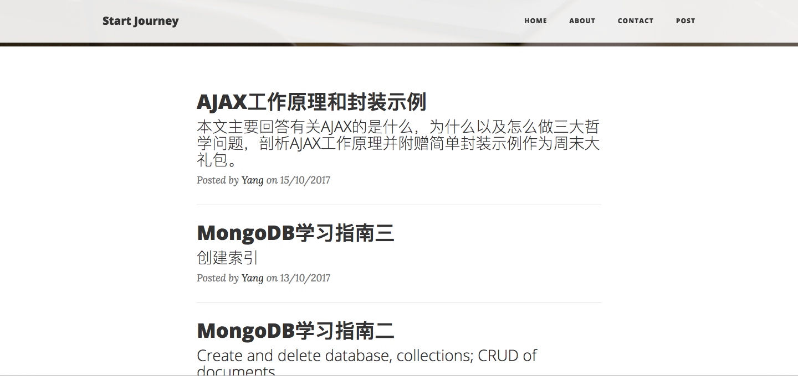

# 个人博客
## Python Flask框架
## 数据库使用 MongoDB
## nginx + gunicorn + supervisor + flask 部署

### 查看[博客](http://watercode.cc)

### 功能:
1.博客新建、修改、删除;
2.访客在网站的留言将以邮件的形式发送给博主;
3.SweetAlert提示;
4.更多功能即将上线;

## Screenshot

